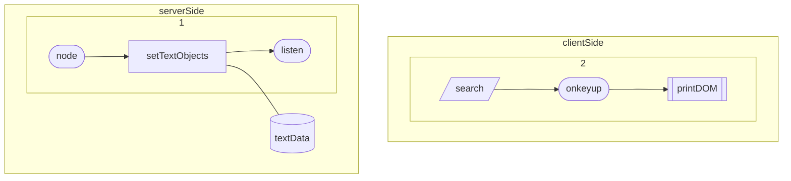

```mermaid
flowchart TD


subgraph clientSide
subgraph 2

input[/search/]-->
event([onkeyup])-->render[[printDOM]]
end
end

subgraph serverSide
subgraph 1

server([node])-->array[setTextObjects]
array-->listening([listen])

end
array---data[(textData)] 
end


```

